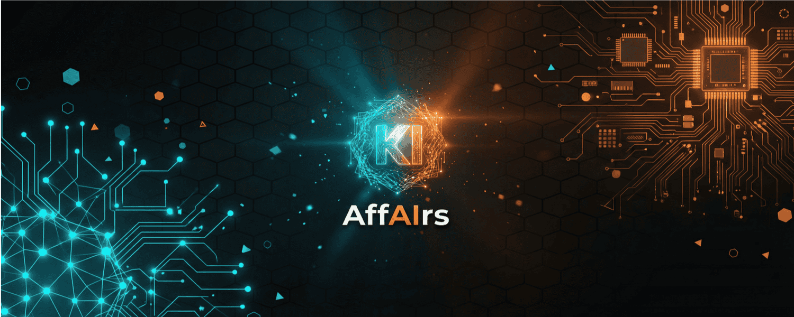

<p align="center">
  
</p>

# Human Oversight

**A simple framework that keeps the human in control when working with AI — and puts EU AI Act (Art. 14) into everyday practice.**

> 🇩🇪 *Deutsche Version: [README.md](README.md)*

---

## What is this about?

AI is fast and usually good. That is exactly what creates two problems:

1. **You stop thinking for yourself.** Anyone who accepts results unchecked gradually loses their own judgment. Studies show a clear link between intensive, unreflected AI use and declining critical thinking.
2. **You start too much at once.** Because everything is so easy with AI, you begin ten things at the same time — and finish none of them properly.

**Human Oversight** is a framework against both. It makes sure you understand every step, can intervene at any time, and carry the responsibility in the end — instead of trusting the machine blindly.

This aligns with what the **EU AI Act (Article 14)** already requires for important AI systems: genuine human oversight, not mere rubber-stamping.

---

## The three modes

You don't have to memorize anything — the framework picks the right mode automatically based on the situation. At its core there are three:

### 1. Plan & Prioritize
*Before you start.*

Too many things on your plate? This mode walks through all your projects with you, asks honest questions ("Who pays for this? What happens if you **don't** do it?") and sorts everything into four clear priority levels. Plus a realistic capacity check: what actually fits into your week?

**The key question:** Want to start something new while the most important thing isn't finished yet? → *"Which running project do you park in exchange?"*

### 2. Transparent Steps
*While the work happens.*

Instead of simply handing you a finished result, the AI works step by step — and explains each one:

- *"I'm now doing X, because Y."*
- *"Here's my intermediate result: …"*
- *"Do you see why I chose this path instead of another?"*

This keeps you alert and lets you correct course at any time, before a finished result ends up going in the wrong direction.

### 3. Quality Gate
*Before the result goes out.*

A structured final check, the **RALF loop**:

| Step | Checks |
|------|--------|
| **R**easoning | Is the reasoning complete? Hidden assumptions? |
| **A**nalysis | Was everything relevant considered? Counter-arguments? |
| **L**ogic | Contradictions? Logical leaps? |
| **F**actcheck | Are numbers, names, sources correct? |

At the end, the AI tells you honestly **where it is least certain** — so you look exactly there. And: nothing counts as "done" until you approve it. You can say "Stop" at any time.

---

## How do I use this?

You can apply Human Oversight in three ways — pick the one that fits:

### A) As a method in your head (no setup)
Read the three modes and apply them deliberately. Even just knowing "I'll have the path explained to me and actively check the result" changes how you work with AI.

### B) As a building block in your AI chat (copy & paste)
Paste this text at the start of your chat (e.g. ChatGPT, Claude or Gemini), and the AI will follow it:

```
You work according to the Human Oversight principle:
1. NEVER deliver a final result directly. Explain your approach first.
2. Show intermediate steps and ask one comprehension question per step.
3. Wait for confirmation before continuing.
4. Before the final result: check Reasoning, Analysis, Logic, Factcheck (RALF).
5. Show me where you are least certain.
6. The result is only done once I approve it.
```

### C) As a skill in Claude Code / a workflow building block
The file [`SKILL.md`](SKILL.md) is the full framework in detail. It works directly as a skill in Claude Code (drop it into the skills folder) and also contains ready-made building blocks for automated workflows (e.g. n8n or agent frameworks such as CrewAI).

---

## Who is this for?

- **Individuals & freelancers** who work with AI and don't want to lose the overview (or their own judgment).
- **Teams** that build AI into their processes and need to stay accountable.
- **Companies with compliance requirements** (EU AI Act, GDPR) that want to implement human oversight in practice.

You need **no technical background.** If you use AI and occasionally think "wait, do I still understand what's happening here?" — then this framework is for you.

---

## Contents of this repo

| File | What's inside |
|------|---------------|
| [`README.md`](README.md) | Introduction (German) |
| [`README.en.md`](README.en.md) | This introduction (English) |
| [`SKILL.md`](SKILL.md) | The full framework in detail (also usable as a Claude Code skill) |
| [`LICENSE`](LICENSE) | License (CC BY 4.0) |
| [`NOTICE`](NOTICE) | Attribution notice — carries the CC BY 4.0 attribution requirement |

---

## License & author

© Claus Zeißler. Licensed under **[Creative Commons CC BY 4.0](LICENSE)** — you may freely use, share and adapt the framework as long as you credit the author.

More: [affairs-consulting.de](https://www.affairs-consulting.de)
